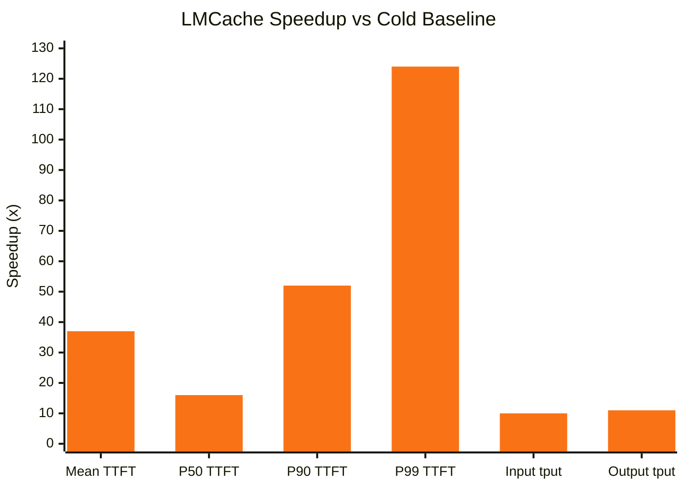
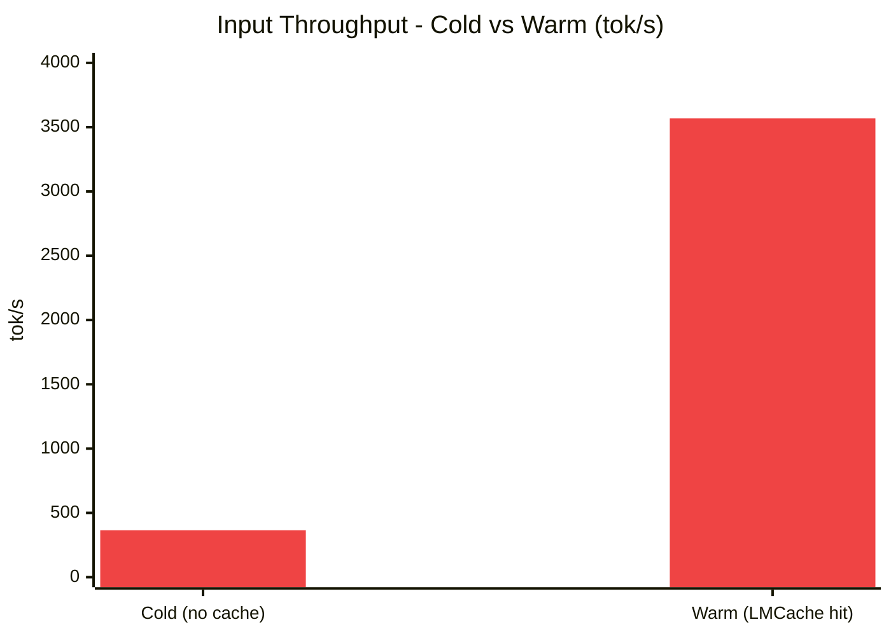
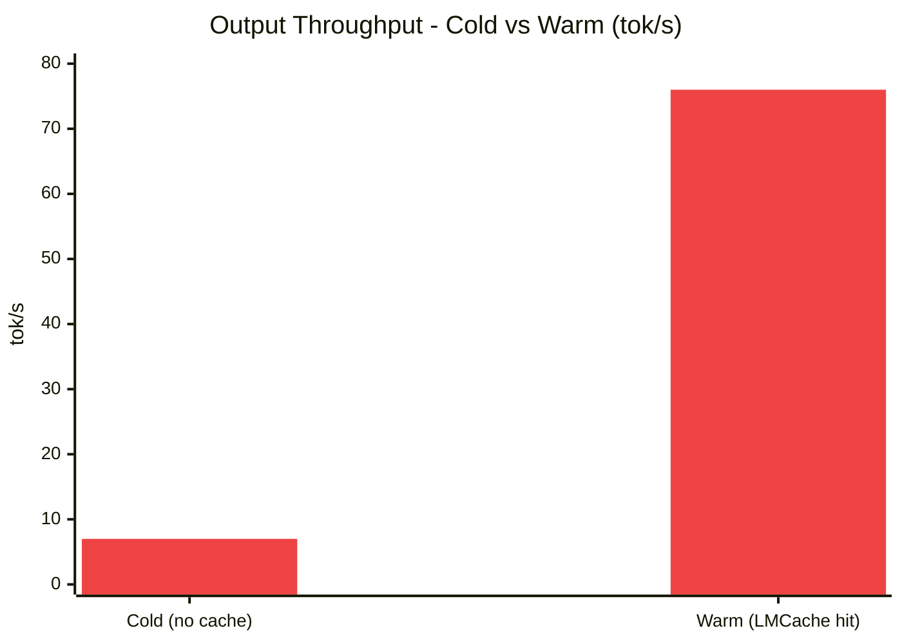
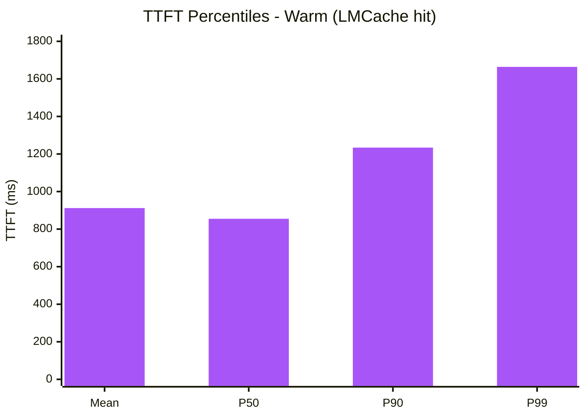

# LMCache + vLLM — KV Cache Offload

Scripts and benchmarks for running [LMCache](https://lmcache.ai) KV-cache offloading
alongside [vLLM](https://vllm.ai). Tested on NVIDIA DGX Spark but works on any
CUDA-capable machine meeting the requirements below.

## How it works

LMCache stores the KV cache computed during prefill in CPU memory. Subsequent requests
that share a long prefix skip prefill entirely — the official benchmark reports
**~7.43× speedup** on warm requests.

```
Client request
  └─► vLLM (GPU)
        ├─► [COLD] compute KV → write to LMCache server (CPU RAM)
        └─► [WARM] read KV from LMCache server → skip prefill (~7× faster)

LMCache standalone server
  ├─► HTTP :8080  —  management API  (clear cache, metrics)
  └─► ZMQ  :5555  —  data plane      (vLLM connects here)
```

## Infrastructure requirements

| Resource | Minimum | Recommended |
|---|---|---|
| GPU | 16 GB VRAM (CUDA 12+) | 40 GB+ (A100, H100, GB10) |
| CPU RAM | 16 GB (for L1 cache) | 64 GB+ |
| Disk | 20 GB (model weights) | SSD, 100 GB+ |
| Python | 3.10+ | 3.12 |
| CUDA | 12.1+ | 12.4+ |
| OS | Linux (Ubuntu 22.04+) | Ubuntu 24.04 |

> **Multi-GPU:** vLLM supports tensor parallelism via `--tensor-parallel-size`.
> Set it to the number of GPUs. LMCache works the same regardless of GPU count.

> **Unified memory (DGX Spark / GB200):** `nvidia-smi` reports `[N/A]` for free
> memory on Grace Blackwell chips. `start_vllm.sh` auto-detects free memory via
> `torch.cuda.mem_get_info()` and uses 90% of it. Override with `VLLM_GPU_MEM=0.xx`
> if you need a fixed value (e.g. when co-locating multiple models).

## Repository layout

```
.
├── setup/
│   ├── install.sh           # one-time setup: create venv, install vLLM + LMCache
│   ├── start_lmcache.sh     # start the standalone LMCache server
│   └── start_vllm.sh        # start vLLM wired to LMCache
├── benchmark/
│   ├── benchmark.sh         # official lmcache bench engine benchmark (TTFT / throughput)
│   ├── observe.sh           # live observability dashboard (GPU · vLLM · LMCache)
│   ├── bench_config.json    # workload config for lmcache bench engine
│   ├── experiments.py       # custom benchmark suite — cold vs warm timing
│   ├── cache_utils.py       # clear cache via HTTP (POST /clear-cache)
│   └── offloadtocpu.py      # minimal reference: in-process vLLM + LMCache
├── configs/
│   └── lmcache_cpu.yaml     # example LMCache server config (CPU-only L1 backend)
└── results/                 # benchmark output (JSON + CSV, git-ignored)
```

## Quick start

### 1 — Install

On Ubuntu, ensure `python3-venv` is available before running the installer:

```bash
sudo apt install python3-venv python3-full
```

Then clone and install:

```bash
git clone https://github.com/umianta/lmcache-vllm
cd lmcache-vllm
./setup/install.sh
```

Creates `.venv/` and installs `vllm` and `lmcache[vllm]` into it using the venv's
own pip — no system packages are touched.

### 2 — Start LMCache server (terminal 1)

```bash
./setup/start_lmcache.sh
```

Starts a standalone LMCache process with a 20 GB CPU L1 cache and LRU eviction.
Adjust `LMCACHE_L1_SIZE_GB` to match your available RAM.

### 3 — Start vLLM (terminal 2)

```bash
./setup/start_vllm.sh
```

Starts `vllm serve Qwen/Qwen3-8B` on port **8001** connected to LMCache over ZMQ.

**Override defaults with environment variables:**

```bash
VLLM_MODEL=meta-llama/Llama-3.1-8B-Instruct ./setup/start_vllm.sh
VLLM_GPU_MEM=0.85 ./setup/start_vllm.sh     # pin a specific fraction
VLLM_PORT=8002 ./setup/start_vllm.sh        # different port
```

### 4 — Run the official LMCache benchmark (terminal 3)

Uses `lmcache bench engine` to send a `long-doc-qa` workload and report **TTFT**,
decoding speed, and throughput for cold vs. warm requests.

```bash
./benchmark/benchmark.sh
```

Override defaults with flags or environment variables:

```bash
./benchmark/benchmark.sh --engine-url http://localhost:8001 --output-dir results/run1

ENGINE_URL=http://localhost:8002 ./benchmark/benchmark.sh
```

To regenerate `benchmark/bench_config.json` interactively (e.g. after switching
models or tuning KV cache size):

```bash
./benchmark/benchmark.sh --interactive
# answer the prompts, then copy the exported bench_config.json to benchmark/
```

Results are written to `results/bench_results_<timestamp>.json`.

#### Benchmark options

| Flag | Default | Description |
|---|---|---|
| `--engine-url URL` | `http://localhost:8001` | vLLM inference endpoint |
| `--lmcache-url URL` | `http://localhost:8080` | LMCache HTTP management API |
| `--config FILE` | `configs/bench_config.json` | Workload configuration |
| `--output-dir DIR` | `results/` | Where to write results |
| `--interactive` | — | Generate a new config via interactive prompts |

### 5 — Run custom experiments (terminal 3)

```bash
source .venv/bin/activate

python3 benchmark/experiments.py --list       # see all experiments
python3 benchmark/experiments.py baseline     # cold vs warm reference
python3 benchmark/experiments.py all          # run everything
```

### 6 — Clear the cache

```bash
python3 benchmark/cache_utils.py
# or directly:
curl -X POST http://localhost:8080/clear-cache
```

---

## Experiments

| Name | What it tests |
|---|---|
| `baseline` | Single long prefix — cold vs warm reference timing |
| `multi_suffix` | 5 suffixes on the same prefix — batch cache-hit exercise |
| `short_prefix` | Very short prefix — near-zero benefit, measures cold overhead |
| `long_prefix` | ~7 k token prefix — stresses the CPU buffer at scale |
| `three_runs` | Three passes — verifies cache stability beyond first warm hit |
| `long_output` | 128-token output — isolates decode latency from prefill savings |

### Reading the output

```
  [COLD]   suffix='Hello, my name is'   2.41s  → ' John'
  [COLD]   pass total: 2.41s

  [WARM 1] suffix='Hello, my name is'   0.32s  → ' John'
  [WARM 1] pass total: 0.32s

  Speedup (cold / warm-1): 7.53x  (doc reference ≈ 7.43x)
```

- **COLD** — first pass, KV computed from scratch and written to CPU RAM
- **WARM N** — Nth pass, KV read from CPU RAM, prefill skipped
- Speedup is `cold_total / warm1_total`

---

## Benchmark Results

Measured on NVIDIA DGX Spark (GB10, 121.63 GiB unified memory) with Gemma4 stopped
to free GPU memory. Cold run = empty LMCache. Warm run = LMCache L1 populated from
the cold run (cross-run caching).

### Configuration

| Setting | Value |
|---|---|
| Model | Qwen/Qwen3-8B (bfloat16) |
| Hardware | NVIDIA DGX Spark — GB10, 121.63 GiB unified memory |
| GPU memory utilization | 0.71 (auto-detected — 90% of free) |
| KV cache blocks | 31,817 × 16 tok = ~509K token capacity |
| LMCache L1 size | 20 GB |
| Document length | 6,000 tokens |
| Queries per document | 3 |
| Concurrent requests | 16 |
| Shuffle policy | round\_robin |

### Cold vs Warm

| Metric | Cold | Warm | Speedup |
|---|---|---|---|
| Mean TTFT | 33,951 ms | 912 ms | **37×** |
| P50 TTFT | 13,609 ms | 855 ms | 15.9× |
| P90 TTFT | 63,511 ms | 1,234 ms | 51.5× |
| P99 TTFT | 206,640 ms | 1,664 ms | 124× |
| Input throughput | 365 tok/s | 3,568 tok/s | **9.8×** |
| Output throughput | 7.1 tok/s | 75.9 tok/s | 10.7× |
| Mean decode | 4.0 tok/s | 5.1 tok/s | 1.3× |

### Speedup factors vs cold baseline (×, higher is better)



### Input Throughput: Cold vs Warm (tok/s, higher is better)



### Output Throughput: Cold vs Warm (tok/s, higher is better)



### TTFT percentiles — Warm run (ms, lower is better)



### Notes

- **Cold**: prefill computed from scratch; KV written to LMCache L1 after each request
- **Warm**: prefill skipped; KV loaded from LMCache L1 (~900 ms transfer latency)
- **Decode (1.3×)**: decode is memory-bandwidth bound, not prefill-bound — LMCache does not accelerate it
- **P99 TTFT (124×)**: cache benefit is largest for the longest documents in the workload
- Running Gemma4 alongside Qwen reduces KV capacity from ~72 GiB to ~13 GiB and raises cold TTFT ~3×; stop it with:
  ```bash
  kubectl scale deployment gemma4-vllm -n llm-d --replicas=0
  ```

---

## Configuration reference

### `start_vllm.sh` environment variables

| Variable | Default | Description |
|---|---|---|
| `VLLM_MODEL` | `Qwen/Qwen3-8B` | Model to serve (any HuggingFace ID) |
| `VLLM_PORT` | `8001` | vLLM HTTP port |
| `VLLM_GPU_MEM` | auto (90% of free) | GPU memory fraction (0.0–1.0); auto-detected via `torch.cuda.mem_get_info()` |
| `VLLM_MAX_LEN` | `8192` | Max context length in tokens |
| `LMCACHE_HOST` | `tcp://localhost` | LMCache ZMQ host |
| `LMCACHE_PORT` | `5555` | LMCache ZMQ port |

### `start_lmcache.sh` flags

| Flag | Default | Description |
|---|---|---|
| `--l1-size-gb` | `20` | CPU RAM budget for the L1 cache |
| `--eviction-policy` | `LRU` | `LRU` or `FIFO` |
| `--chunk-size` | `16` | Token chunk size for cache blocks |

---

## Troubleshooting

### `ValueError: Free memory ... is less than desired GPU memory utilization`

`start_vllm.sh` auto-detects free memory and uses 90% of it, so this should be
rare. If it still occurs, another process is consuming GPU memory between detection
and startup. Check what's running and either stop it or pin a lower fraction:

```bash
nvidia-smi --query-compute-apps=pid,process_name,used_memory --format=csv

# On Kubernetes: stop a co-located model pod
kubectl scale deployment <name> -n <namespace> --replicas=0

# Or pin a fixed fraction
VLLM_GPU_MEM=0.70 ./start_vllm.sh
```

### `error: externally-managed-environment` during install

Ubuntu 22.04+ prevents pip from installing into the system Python. The fix is to
ensure `python3-venv` is installed so the venv can be created with its own pip:

```bash
sudo apt install python3-venv python3-full
./install.sh
```

The scripts never touch the system Python — all binaries are called as
`.venv/bin/pip`, `.venv/bin/vllm`, etc.

### `.venv/bin/pip: No such file or directory` during install

The venv was created without pip (happens on some Ubuntu setups). Delete it and
reinstall — `install.sh` now bootstraps pip automatically via `ensurepip`:

```bash
rm -rf .venv
./install.sh
```

### `exec: lmcache: not found` or `exec: vllm: not found`

The venv does not exist or `./install.sh` did not complete. Run it first:

```bash
./install.sh
```

### `Cannot reach http://localhost:8080`

Start the LMCache server first (`./start_lmcache.sh`) before running vLLM or
`cache_utils.py`.

### SSH disconnects under high GPU load

On high-load servers `pam_systemd` can time out creating new SSH sessions (common
with VS Code Remote). Fix:

```bash
sudo sed -i 's/^session\toptional\tpam_systemd\.so/# &/' /etc/pam.d/common-session
sudo systemctl restart ssh
```

---

## Tested with

| Component | Version |
|---|---|
| vLLM | 0.23.0 |
| LMCache | 0.4.7 |
| Python | 3.12 |
| CUDA | 12.4 |
| Model | Qwen/Qwen3-8B |
| Hardware | NVIDIA DGX Spark (GB10, 128 GiB unified memory) |

## References

- [LMCache documentation](https://docs.lmcache.ai)
- [LMCache multiprocess quickstart](https://docs.lmcache.ai/mp/quickstart.html)
- [vLLM KV transfer config](https://docs.vllm.ai/en/latest/features/disagg_prefill.html)
